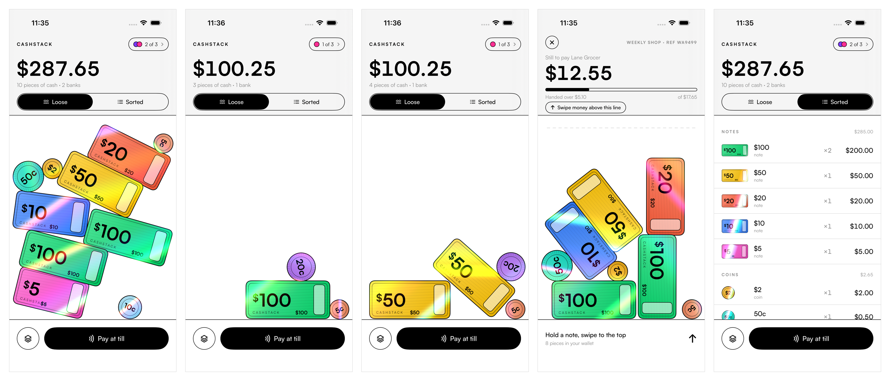

# CashStack

A wallet that shows the money in your bank accounts as actual cash — Australian
notes and coins, in multiples, piled up and obeying gravity. Tip the phone and
the pile sloshes. To pay, you hold a note and swipe it off the top of the
screen, and your change falls back down.

This is a working demo: a native iOS app, TestFlight-ready, with the bank layer
behind a protocol so real institutions can be plugged in.



## Running it

```bash
open CashStack.xcodeproj
```

Pick an iPhone simulator and hit run. From the command line:

```bash
xcodebuild -project CashStack.xcodeproj -scheme CashStack -sdk iphonesimulator -destination 'platform=iOS Simulator,name=iPhone 17 Pro' build
```

Gravity comes from CoreMotion, so the sloshing only really shows on a device.
On the Simulator the pile falls straight down and the holographic sheen runs on
a timer instead of on tilt.

## The idea

| | |
|---|---|
| **Loose** | The physics pile. Every piece of money is a body in a SpriteKit world whose gravity vector is the phone's own. Shake it and the pile jumps. |
| **Sorted** | The same cash, counted: denomination, count, subtotal, total. For when you need the number, not the feeling. |
| **Break it up** | Double tap a note or coin and it bursts into the fewest smaller pieces of the same value. A $100 becomes two $50s; a $50 becomes two $20s and a $10. The 5c has nothing to break into, so it just shakes its head. |
| **Pay** | Tap **Pay at till** and the till rings something up by itself — no menu to choose from. The amount sits at the top and counts down as you hand money over. Press and hold a note, swipe it above the dashed line, let go. It's gone. |

Overpay and the figure at the top turns **green and goes negative** — that is
your change, and it sits there for a beat so you can read it before the payment
settles and the coins fall back in. Hand over more while it is negative and it
simply counts further down.

The pile is the source of truth, not a freshly-computed breakdown. Pay for a
$14.95 book with a $20 and you are genuinely carrying $5.05 of change
afterwards — a $5 and a 5c — until you tap **tidy** (the stack icon, bottom
left), which re-breaks the balance into the fewest possible pieces.

The top bar is glass and the physics world runs the full height of the screen
behind it, so a note swiped up to pay is still visible through the frosted bar
rather than disappearing under it. The bottom bar is solid and the pile lands on
its top edge, so nothing in the wallet is ever hidden.

## How it is put together

```
CashStack/
  Model/Denomination.swift     Sterling denominations, sizes, and the breakdown maths
  Banking/BankDataSource.swift The protocol every bank conforms to, plus the demo source
  Banking/WalletStore.swift    Merges accounts, holds the pile, settles payments
  Physics/CashScene.swift      SpriteKit world: gravity, walls, the pay line, drag-to-pay
  Physics/MoneyNode.swift      One note or coin as a physics body
  Physics/MotionManager.swift  CoreMotion gravity and shake, delivered by closure
  Banking/DemoTill.swift       The merchant side: a short menu, rung up at random
  Design/MoneyArt.swift        The notes and coins, drawn at runtime — no image assets
  Design/HoloShine.swift       The holographic shader
  Design/Fonts.swift           Registers Satoshi at launch
  Resources/Fonts/             Satoshi, five weights, with its licence
  Views/                       SwiftUI chrome, sorted view, accounts, till
```

**Design.** White ground, black hairlines at 1pt, Satoshi throughout, bright
money. The money is drawn big — a note is about half the screen wide — because
it is meant to be grabbed with a thumb, and every detail in `MoneyArt` is a
fraction of the note's height so the design holds together at any size. The notes and coins are drawn with CoreGraphics at launch and cached, so
there is nothing to redraw and nothing to ship.

**Type.** Satoshi ships in `Resources/Fonts` (Light, Regular, Medium, Bold,
Black) under the Fontshare free licence, which is included alongside it.
`Fonts.register()` registers the faces with CoreText at launch rather than
going through `UIAppFonts`, so they are available to SwiftUI, to the UIKit
navigation chrome, and to the CoreGraphics code that draws the money — with one
list of faces rather than two. `Theme` is the only place that names a font.

**The holographic shine** is a fragment shader on each piece of money
(`Design/HoloShine.swift`). A rainbow band sweeps diagonally on a slow loop,
staggered across four shader instances so the pieces do not all flash together,
and a second softer sheen tracks the device's roll — so the foil catches the
light as the handset moves. In the sorted view the SwiftUI thumbnails get the
same treatment with an animated gradient (`MoneyThumb` in
`Design/Components.swift`); the band is flattened with `compositingGroup()`
before being masked by the artwork, or the additive blend leaks past the note's
edges and the shine reads as a square sitting on top of the money.

**Motion** is read at 60Hz and handed to the scene by closure rather than
`@Published`, which would re-render the whole SwiftUI tree sixty times a second.

## Connecting real banks

Everything above `BankDataSource` is ignorant of where a balance came from:

```swift
protocol BankDataSource: AnyObject {
    var institution: Institution { get }
    func connect() async throws
    func accounts() async throws -> [LinkedAccount]
    func debit(accountID: String, minor: Int) async throws
}
```

`WalletStore` holds an array of these and merges whatever they return, so
multi-bank aggregation is just "add another source". To go live, write one
conforming type per route — an Open Banking AISP (TrueLayer, Plaid, Yapily) or a
bank's own API — have `connect()` run the consent flow, and pass it to
`WalletStore.link(_:)`. Nothing else changes. The demo ships three
`DemoBankDataSource` instances with in-memory balances and a deliberate delay so
the loading states are real.

`debit` is where a demo and a real wallet part company: here it decrements a
number, whereas a shipping app would initiate a payment and only move the cash
on screen once the payment is confirmed.

## Tests

```bash
xcodebuild -project CashStack.xcodeproj -scheme CashStack -sdk iphonesimulator -destination 'platform=iOS Simulator,name=iPhone 17 Pro' test
```

`CashStackUITests` drives the real gestures. Every piece of money is named after
its denomination, which puts it in the accessibility tree, so a test can pick up
a particular $100 note and swipe it to the top exactly as a person would. The
suite covers the balance breaking into the right notes and coins, the till
ringing up an amount by itself, the figure counting down and then going
negative, settling with change, cancelling and getting your money back, paying
from the sorted view, double tapping to break a note into smaller money, and
accounts going in and out of the pile.

Where the pile settles decides what is lying on top of what, so a test cannot
assume the piece it reaches for is the piece it gets. The payment tests pick
whichever piece is lying lowest on screen — clear of the glass header, where a
tap would land on the chrome instead — and then assert the arithmetic rather
than naming a note. The splitting test narrows the wallet to a single $100 so
the piece under the thumb is not in doubt.

`ScreenshotTests` walks the app through every screen and attaches a shot of each.

> If a test fails in a way that makes no sense, delete the app off the simulator
> first — `xcrun simctl uninstall booted com.bokscot.cashstack`. A stale install
> will happily run old code against new tests.

## TestFlight

The project archives for device as-is; it only needs signing details.

1. In **Signing & Capabilities**, pick your team. The bundle id is
   `com.bokscot.cashstack` — change it to one your team owns.
2. Bump `MARKETING_VERSION` / `CURRENT_PROJECT_VERSION` in the build settings.
3. **Product ▸ Archive**, then **Distribute App ▸ TestFlight**.

Already in place: portrait-only, light appearance, iOS 17 minimum, a 1024px app
icon in the asset catalog, no third-party dependencies, and no private API use.
CoreMotion's device motion needs no usage description, so there is no extra
privacy string to write.

Before a public release you would still need an App Privacy declaration covering
the financial data the bank connections read.

## What this demo does not do

- No real bank connection, no consent flow, no payment rails — `debit` moves a
  number in memory.
- Splitting stops at `Money.maxLoosePieces` (120). Without a cap, a determined
  thumb could turn a hundred dollars into two thousand 5c coins and the physics
  would grind to a halt.
- Australian dollars only. `Denomination.all` is the whole catalogue; another
  currency means another list and the breakdown maths works unchanged. Cash
  settles in 5c steps, since Australia withdrew the 1c and 2c — `Money.cashable`
  is what keeps the pile and the balance honest about that.
- Nothing is persisted. Relaunching resets the wallet.
- Very large balances mean very many notes. A real build would bundle them
  above some count rather than simulating three hundred bodies.
